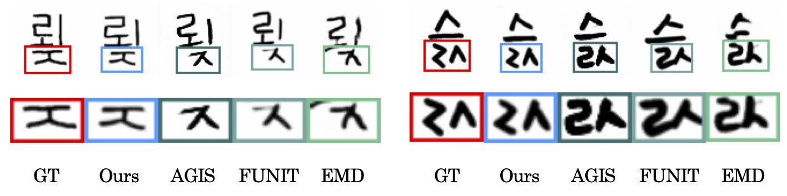

## Few-shot Compositional Font Generation with Dual Memory (ECCV'20)

**NOTICE: We release the unified few-shot font generation repository ([clovaai/fewshot-font-generation](https://github.com/clovaai/fewshot-font-generation)). If you are interested in using our implementation, please visit the unified repository.**

<p align="center"></p>

Official PyTorch implementation of DM-Font | [Paper](https://arxiv.org/abs/2005.10510) | [Video on ECCV 2020](https://youtu.be/VMrMJf21XEA)

Junbum Cha, Sanghyuk Chun, Gayoung Lee, Bado Lee, Seonghyeon Kim, Hwalsuk Lee.  
Clova AI Research, NAVER Corp.  
In ECCV 2020.

### Abstract

Generating a new font library is a very labor-intensive and time-consuming job for glyph-rich scripts. Despite the remarkable success of existing font generation methods, they have significant drawbacks; they require a large number of reference images to generate a new font set, or they fail to capture detailed styles with a few samples. In this paper, we focus on compositional scripts, a widely used letter system in the world, where each glyph can be decomposed by several components. By utilizing the compositionality of compositional scripts, we propose a novel font generation framework, named Dual Memory-augmented Font Generation Network (DM-Font), which enables us to generate a high-quality font library with only a few samples. We employ memory components and global-context awareness in the generator to take advantage of the compositionality. In the experiments on Korean-handwriting fonts and Thai-printing fonts, we observe that our method generates a significantly better quality of samples with faithful stylization compared to the state-of-the-art generation methods in quantitatively and qualitatively.

## Other related repositories

You can find more related projects on the few-shot font generation at the following links:

- [clovaai/dmfont](https://github.com/clovaai/dmfont) (ECCV'20) | [paper](https://arxiv.org/abs/2005.10510)
- [clovaai/lffont](https://github.com/clovaai/lffont) (AAAI'21) | [paper](https://arxiv.org/abs/2009.11042)
- [clovaai/mxfont](https://github.com/clovaai/mxfont) (ICCV'21) | [paper](https://arxiv.org/abs/2104.00887)
- [clovaai/fewshot-font-generation](https://github.com/clovaai/fewshot-font-generation) The unified few-shot font generation repository

## Installation

Install dependencies:

```
pip install -r requirements.txt
```

Note that using different version of required packages can effects the results, especially PyTorch. The implementations are tested on Python 3.6.

## Dataset preparation

### Data sources

Korean-handwriting and Thai-printing datasets were built from [UhBee fonts](http://uhbeefont.com/) and [Thai font collection](https://github.com/jeffmcneill/thai-font-collection), respectively.
To ensure the style diversity of the dataset, one font was selected for each font family in our experiments.

### Dumping dataset

The `scripts/prepare_dataset.py` script renders glyphs from the collected ttf fonts and dumps them into hdf5 files.
For the Thai-printing dataset, we rectify the rendering errors using [raqm](https://github.com/HOST-Oman/libraqm).
It should be installed before making dataset.

- Korean-handwriting

```
python -m scripts.prepare_dataset kor $FONTSDIR meta/kor_split.json $DUMPDIR
```

- Thai-printing

```
python -m scripts.prepare_dataset thai $FONTSDIR meta/thai_split.json $DUMPDIR
```

## How to run

### Pretrained models

For convenience, the minimal size checkpoints are provided by excluding training variables, e.g., momentums in optimizer, discriminator, or non-EMA generator.

- [Checkpoint trained on the Korean-handwriting dataset (Google drive)](https://drive.google.com/file/d/1y_8XDNtawtA2P7-pHbCQ3yGEcFX-9H1R/view?usp=sharing)
- [Checkpoint trained on the Thai-printing dataset (Google drive)](https://drive.google.com/file/d/1z_MqlCiq_7aMo7Rugn_jMOUbAmCLM4Up/view?usp=sharing)


### Training

- Korean-handwriting

```
python train.py $NAME cfgs/kor.yaml
```

- Thai-printing

```
python train.py $NAME cfgs/kor.yaml cfgs/thai.yaml
```

### Generation & Pixel-level evaluation

- Korean-handwriting

```
python evaluator.py $NAME $CHECKPOINT_PATH $OUT_DIR cfgs/kor.yaml --mode cv-save
```

- Thai-printing

```
python evaluator.py $NAME $CHECKPOINT_PATH $OUT_DIR cfgs/kor.yaml cfgs/thai.yaml --mode cv-save
```

- Korean-unrefined

```
python evaluator.py $NAME $CHECKPOINT_PATH $OUT_DIR cfgs/kor.yaml --mode user-study-save
```


## Citation

```
@inproceedings{cha2020dmfont,
    title={Few-shot Compositional Font Generation with Dual Memory},
    author={Cha, Junbum and Chun, Sanghyuk and Lee, Gayoung and Lee, Bado and Kim, Seonghyeon and Lee, Hwalsuk},
    year={2020},
    booktitle={European Conference on Computer Vision (ECCV)},
}
```

## License

This project is distributed under [MIT license](LICENSE), except modules.py which is adopted from https://github.com/NVlabs/FUNIT.

```
Copyright (c) 2020-present NAVER Corp.

Permission is hereby granted, free of charge, to any person obtaining a copy
of this software and associated documentation files (the "Software"), to deal
in the Software without restriction, including without limitation the rights
to use, copy, modify, merge, publish, distribute, sublicense, and/or sell
copies of the Software, and to permit persons to whom the Software is
furnished to do so, subject to the following conditions:

The above copyright notice and this permission notice shall be included in
all copies or substantial portions of the Software.

THE SOFTWARE IS PROVIDED "AS IS", WITHOUT WARRANTY OF ANY KIND, EXPRESS OR
IMPLIED, INCLUDING BUT NOT LIMITED TO THE WARRANTIES OF MERCHANTABILITY,
FITNESS FOR A PARTICULAR PURPOSE AND NONINFRINGEMENT.  IN NO EVENT SHALL THE
AUTHORS OR COPYRIGHT HOLDERS BE LIABLE FOR ANY CLAIM, DAMAGES OR OTHER
LIABILITY, WHETHER IN AN ACTION OF CONTRACT, TORT OR OTHERWISE, ARISING FROM,
OUT OF OR IN CONNECTION WITH THE SOFTWARE OR THE USE OR OTHER DEALINGS IN
THE SOFTWARE.
```
